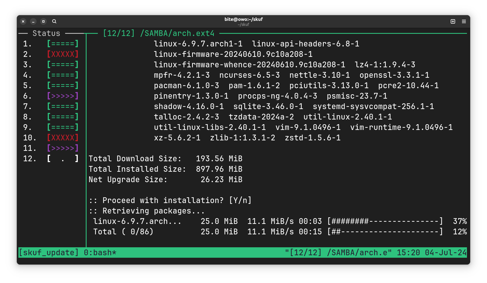

# SKUF - Suckless Kexec Using Fileshare 

> Ever wanted to be able to boot Linux[^1] over the network using an Ethernet cable but without setting up a PXE? Now you only need a SMB server that can be installed anywhere!

**SKUF Network Boot System** allows you to boot the [Arch Linux](https://archlinux.org)[^2] operating system on a computer connected to network via Ethernet using USB flash drive (150MB minimum) and a SMB file share.

> [!CAUTION]
> **The only supported distribution is Arch Linux™.** Other shitty systems like Debian, Ubuntu, Manjaro, Fedora, openSUSE, etc. are NOT supported and NEVER WILL BE.


## Requirements

Two computers in the same network:

**Server**:
- [x] Running SMB file server
- [x] Your user on the SMB server **has a password**. Users without password or anonymous access **are not supported** 

**Client**:
- [x] Connected to network via Ethernet cable. Wireless is not supported.
- [x] A USB stick/CD/DVD with the `skuflinux` image (you can also use [Ventoy](https://www.ventoy.net))
- [x] Brain not poisoned with beer so you have enough brain cells to read this manual

> [!CAUTION]
> **Prebuilt binaries and ISO images will NEVER be available** due to possible security risks. Read the build instructions carefully.

## Scheme of work
> [!NOTE] 
> The example illustrates how the `server` and `client` work together. <br>
> **Server** — a computer with the `SMB` server running. <br>
> **Client** — a computer that will boot the system from the `server` over the network using a cable <br>

You have a USB flash drive/CD/DVD with an ISO image of `skuflinux` on it. You have two PCs in your room/college/office. First one is the one you will be sitting at. The other one is running SMB server with a directory that **you have write access to**. That directory contains filesystem image with the Arch Linux distribution and the `skuf` package installed on it.

### Step 1: Loading kernel and initramfs from SMB server
After booting from USB drive with `skuflinux` you will be prompted to enter SMB server address and port, user credentials and path to filesystem image. Now SKUF script will do the following:

- Obtain an IP address using `dhcpcd`
- Mount the SMB directory (**read-only**)
- Mount the image volume with Arch Linux (**read-only**)
- Generate an encrypted string with your answers to the questions asked earlier
- Load kernel and initramfs from a previously mounted Arch Linux image into RAM
- Unmount SMB and image volume with Arch Linux
- Execute [kexec](https://wiki.archlinux.org/title/kexec)

### Step 2: Re-mounting SMB and running system
Now when the kernel and initramfs of your Arch Linux were loaded from SMB server, SKUF mounts system image again:

- The newly booted system obtaining IP address again
- The previously encrypted string contained your answers to the questions. It was passed to the kernel command line (`/proc/cmdline`) in encrypted form, and will now be decrypted, so you don't have to write it all over again.
- Mounting the SMB directory again (**read/write**)
- Mounting the image with Arch Linux again (**read/write**)
- Once everything mounted, SKUF executes [switch_root](https://man.archlinux.org/man/switch_root.8.en) and system is booted. Congratulations!


## Building

<sub><sup>See also: [Arch Wiki article](https://wiki.archlinux.org/title/Diskless_system#SKUF)</sup></sub>

> [!CAUTION]
> **The only supported distribution is Arch Linux™.** Other shitty systems like Debian, Ubuntu, Manjaro, Fedora, openSUSE, etc. are NOT supported and NEVER WILL BE.

### Required packages
- `arch-install-scripts`
- `archiso`
- `base`
- `base-devel`
- `binutils`
- `clang` or `gcc`
- `musl`
- `linux-api-headers`
- `kernel-headers-musl`
- `patch` (optional, for `build_rootfs_tar.sh`, if patches present)

### Build instructions

Clone this repository using git:
```sh
git clone https://github.com/BiteDasher/skuf
cd skuf
./switch-tag latest
```

Tune encryption obfuscation and encryption password (see [Customization instructions](#Password-tuning)):
```sh
vim tune.password
vim tune.crypt
```

Setup defaults for `ISO` (optional):
```sh
vim defaults
```

Run configuraion sripts:
```sh
./tune_crypt.sh
./tune_password.sh
./setup_defaults.sh
```

Build SKUF:
```sh
./build_rootfs_tar.sh
./build_package.sh
./setup_repo.sh
./build_iso.sh
./create_image.sh SIZE_IN_GIGABYTES additional_packages
# For sparse file, use ./create_image.sh -s
```

> [!NOTE]
> Basic installation of Arch Linux without GUI or any additional software takes about 1 GB.

Done! 💪🎉 Now write `skuflinux-smth.iso` to your USB drive, put `arch.ext4` into your directory on SMB server and try SKUF Network Boot System.


## Customisation instructions
### Password tuning
String for `/proc/cmdline` is encrypted using [OpenSSL](https://www.openssl.org). You need to specify **encryption password** and **number of iterations** in the `tune.password` file in following format:
```
ITERATIONS_COUNT PASSWORD
```
> [!NOTE]
> For an example, see the `tune.passwordX` file

### Obfuscation tuning
String that is encrypted through [OpenSSL](https://www.openssl.org) is eventually turned into a [base64](https://en.m.wikipedia.org/wiki/Base64) string. You can obfuscate this string by swapping these symbols. Write **pairs of letters or numbers** in the following format to the `tune.crypt` file:
```
A B
X Y
I O
0 1
4 8
```
> [!NOTE]
> For an example, see the `tune.cryptX` file

### Defaults setup
When you booted up the `skuflinux` ISO image from your media device, you will be asked questions like: SMB server address, SMB server port, SMB protocol version and so on. Edit the `defaults` file if you want to preset them manually.

Table of main SKUF variables:
|Variable|Meaning|
|:---|:---|
|`SAMBA_USERNAME`|Username for the SMB server \*|
|`SAMBA_PASSWORD`|User password for the SMB server \*|
|`SAMBA_ADDRESS`|Address of the SMB server where the client directory with the `Arch Linux` image is located \*|
|`SAMBA_PORT`|SMB server port|
|`SAMBA_VERSION`|SMB server protocol version|
|`SAMBA_DOMAIN`|Domain for the SMB server (default domain is `WORKGROUP`)|
|`VOLUME_PATH`|Path to the directory on the SMB server where the client Arch Linux image volume and swap file are located(see [Tips and Tricks](#tips-and-tricks)) \*|
|`VOLUME_FILENAME`|Arch Linux image volume name that is located in `VOLUME_PATH` \*|
|`SWAP_FILENAME`|Swap file name that is located in `VOLUME_PATH`|
|`SAMBA_EXTRA_MOUNT_OPTS`|Additional SMB mount options. Applies to both [step 1](#Step-1-Loading-kernel-and-initramfs-from-SMB-server) and [step 2](#Step-2-Re-mounting-SMB-and-running-system) of SKUF boot process|
|`VOLUME_EXTRA_MOUNT_OPTS`|Additional client Arch Linux image volume mount options. Applies to both [step 1](#Step-1-Loading-kernel-and-initramfs-from-SMB-server) and [step 2](#Step-2-Re-mounting-SMB-and-running-system) of SKUF boot process|
|`CHECK_FS`|Whether to check the integrity of a file system image with Arch Linux. Accepts `Yes` or `No`. Applies only to [step 2](#Step-2-Re-mounting-SMB-and-running-system)|
|`EXTRA_KERNEL_OPTS`|Additional linux kernel options|
|`PATH_TO_NEW_KERNEL`|Path to the new kernel that will be loaded using kexec. The new kernel must be in the Arch Linux image that is lies on SMB server \*|
|`PATH_TO_NEW_INITRAMFS`|Path to the new initramfs that will be loaded using kexec alongside kernel. The new initramfs must be in the Arch Linux image that is lies on SMB server \*|
---
Table of auxiliary SKUF variables:
|Variable|Meaning|
|:---|:---|
|`MAX_SMB_RETRY_COUNT`|Maximum number of attempts to re-enter SMB credentials if the first mount attempt failed. Applies only to [step 1](#Step-1-Loading-kernel-and-initramfs-from-SMB-server)|
|`SKIP`|Automate the startup process. Set to `0` or *nothing* if you want to achieve the default behavior of having to enter answers to questions using keyboard. Set to `1` if you want the startup to proceed without your participation. Be sure you have set all the mandatory variables! Applies to [step 1](#Step-1-Loading-kernel-and-initramfs-from-SMB-server)|
> [!NOTE]
> "Mandatory" variables are marked with an **asterisk** at the end.

### Presets using bootloader (iMac with wireless keyboard)
If you need to change any [presets](#Defaults-setup) before booting into **SKUF**, you can change the bootable kernel parameters through the bootloader. This can be useful when you have, for example, an **iMac with a wireless keyboard** that only works in `EFI` applications.
The way to change kernel parameters depends on the bootloader:
- `syslinux`: hit <kbd>Tab</kbd> and start typing
- `grub2`: select entry in menu and click <kbd>e</kbd> to open editor
- `systemd-boot`: click <kbd>e</kbd> and start typing

#### 1. Set presets using variables

You can specify presets using one or more kernel variables like this:
```
skuf.samba_username="Username with spaces"
skuf.SAMBA_PASSWORD='Password \' with \\ character escaping'
skuf.VOLUME_PATH=Path\ with\ spaces\ and\ \"quotes\'
skuf.skip=1
```
The syntax of the variable is as follows: `skuf.` + **any** variable from [SKUF variable table](#Defaults-setup) in lower or upper case.
> [!NOTE]
> - To escape `"` inside `"double quotes"`, use `\"` <br>
> - To escape `'` inside `'single quotes'`, use `\'` <br>
> - To escape `"`, `'`, ` `(whitespace) in case of missing quotation marks, use `\"`, `\'`, `\ ` respectively <br>
> - In all cases above, to escape `\` themselves, use `\\` <br>

#### 2. Set presets using curly or square brackets at the end of kernel parameters

> [!IMPORTANT]
> Variables set via this method will be prioritized over every variable you specified in method №1

**Curly** brackets allow you to set several variables at once:
```
{username;password;address;;;;volume\\path;volume \; file;;;;;;/kernel;/initramfs}
```
The syntax corresponds to the order of the **main** variables from the [SKUF variable table](#Defaults-setup) separated from each other by semicolons.
> [!NOTE]
> - To escape `;`, use `\;` <br>
> - To escape `\` themselves, use `\\` <br>

**Square** brackets allow you to set only username and password at the same time:
```
[username;password;with;semicolons]
```
> [!NOTE]
> Unlike curly brackets, there's no escaping required.

---
- In case you did not specify `skuf.skip` in the kernel parameters, but used [brackets](#2-Set-presets-using-curly-or-square-brackets-at-the-end-of-kernel-parameters) or specified other [kernel variables](#1-Set-presets-using-variables), script will attempt to apply `skuf.skip=1`, but only if you have set (or have already set) the **7** mandatory variables listed above.

- Setting `skuf.skip=1` will omit all variable checks.

- The `skuf.skip` preset in the kernel parameters will have a higher priority than same `SKIP` preset set in the `defaults` file.


## Updating
To update remote systems, use the `update_remote_systems.sh` script from this repository. It should work on **all linux systems** with `bash` and a couple of basic utilities installed. <sub><sup>Short link: [gg.gg/updskuf](http://gg.gg/updskuf)</sup></sub>


*Demonstration of the script running in tmux mode*

Let's assume you have an SMB server mounted in `/samba`:
```
/samba
├── John Doe
│   └── arch.ext4
├── Foo Bar
│   └── arch.ext4
└── Lady Muck
    └── arch.ext4
```

And so, you need to run the following command to update these 3 systems:
```sh
./update_remote_systems.sh /samba/*/arch.ext4
```

> [!TIP]
> To update **SKUF** and the system itself, put the package file somewhere and add `-p /path/to/skuf.pkg.tar` to script arguments.

> [!NOTE]
> To skip a specific system for update, create the `/etc/skuf_disable_external_update` file on the client system.

## Tips and Tricks
- It is highly recommended to have an **individual folder** with a volume file in it for each user on the SMB server. With this setup, there will be fewer possible caching issues (e.g. `cache=singleclient`).

- You can place a swap file next to the Arch Linux image volume so you can use it on your system. The swap file will be connected over the network as a loop device.

- You can use [Plymouth](https://wiki.archlinux.org/title/plymouth) in [step 2](#Step-2-Re-mounting-SMB-and-running-system). Add `splash` to `EXTRA_KERNEL_OPTS` to the `defaults` file, also don't forget to add `HOOKS=(... plymouth ...)` to the `skuf_src/mkinitcpio.conf` and install `plymouth` package.

- In [step 1](#Step-1-Loading-kernel-and-initramfs-from-SMB-server), you can write `@u@` and `@fu@` in the path to the client(your) directory, in the path to the image volume file and in the swap file. If you login as `john@corp.domain`, `@u@` will be `john` and `@fu@` will be `john@corp.domain`.

- After building the ISO image and creating a file system image with Arch Linux you can execute `sudo ./clean.sh` to remove unnedeed files.

- You can execute custom post-install script/binary inside chroot during image creation via `./create_image.sh`. To do this, specify the file location via the `POST_INSTALL` [environment variable](https://wiki.archlinux.org/title/environment_variables).

- Password for `root` and `test` users in `arch.ext4` is `0000`

- If you enter something incorrectly while entering SMB address, kernel path, etc. at [step 1](#Step-1-Loading-kernel-and-initramfs-from-SMB-server) and fall into the interactive shell, write `reboot -f`. No, **you cannot restart the script**. Train your attention.

- If the client computer has `UEFI`, you can install `SKUF` on a `FAT32 EFI` partition so you don't have to use a USB flash drive/CD/DVD. To do this, mount `skuflinux-smth.iso` somewhere (like /mnt), then copy `/mnt/skuf/boot/x86_64/{vmlinuz-linux,initramfs-linux.img}` to `FAT32 EFI` partition and execute `efibootmgr -c -d /dev/sdX -p Y -u 'initrd=\initramfs-linux.img' -l '\vmlinuz-linux' -L 'SKUF'` where */dev/sdX* is the target disk and *Y* is the target `FAT32 EFI` partition number.

## Demonstration

https://github.com/BiteDasher/skuf/assets/48867887/79a5b40d-7a48-4046-a857-aa300a57e137

## Afterword
Huge thanks to the Arch Linux development team for their awesome distribution, [archiso](https://gitlab.archlinux.org/archlinux/archiso) and [mkinitcpio](https://gitlab.archlinux.org/archlinux/mkinitcpio/mkinitcpio) utilities. They made the creation of this project much easier.

[^1]: The registered trademark Linux® is used pursuant to a sublicense from LMI, the exclusive licensee of Linus Torvalds, owner of the mark on a world-wide basis.
[^2]:Copyright © 2002-2024 Judd Vinet, Aaron Griffin and Levente Polyák.
  The Arch Linux name and logo are recognized trademarks. Some rights reserved.
